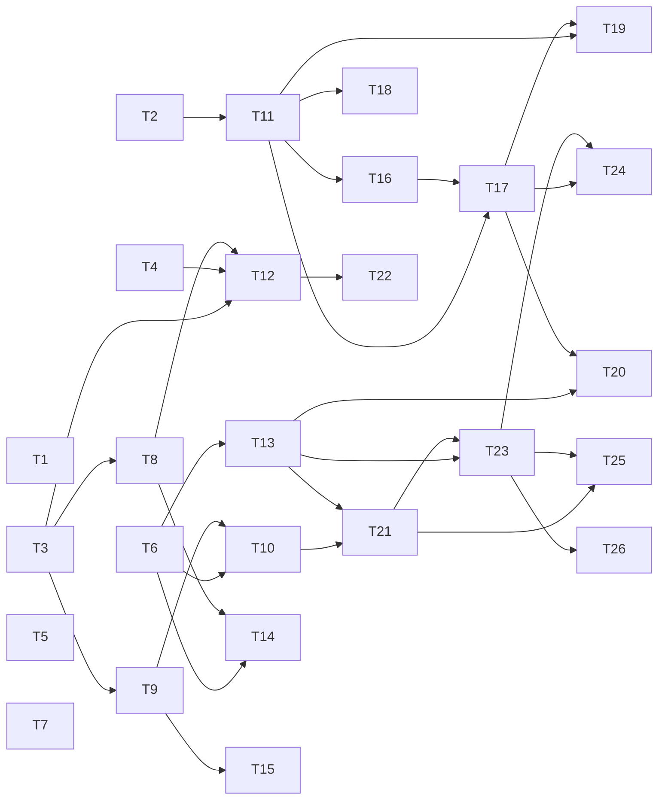

# Build Site: Terminal Blend + Fullscreen Viewport

Source kits:
- `context/kits/cavekit-terminal-blend.md` (R1–R8)
- `context/kits/cavekit-fullscreen-viewport.md` (R1–R9)

All tasks are M-sized unless marked S/L. Each task row is self-contained and can be executed with only the referenced kit R-number(s) plus this row.

---

## Tier 0 — No Blockers (parallel start)

Low-level enablers. These unblock everything else.

| T#  | Title | Kit / R | Scope | Files touched | Depends on |
|-----|-------|---------|-------|---------------|------------|
| T1  | Terminal identity probe (env-var chain) | blend/R2 | M | `packages/tui/src/terminal-detect.ts` (new), `packages/tui/src/index.ts` (export) | — |
| T2  | Terminal background probe (OSC 11 + COLORFGBG + override) | blend/R1 | M | `packages/tui/src/terminal-detect.ts` (extend), `packages/tui/src/terminal.ts` (query helper on `ProcessTerminal`) | — |
| T3  | Alt-screen enter/exit + cursor hide/show in `ProcessTerminal` | viewport/R1 | M | `packages/tui/src/terminal.ts` (add `enterAltScreen`, `leaveAltScreen`, TTY guard), `packages/tui/src/tui.ts` (call on start/stop) | — |
| T4  | Signal + uncaught-exception teardown hooks | viewport/R9 (partial) | M | `packages/tui/src/terminal.ts` (process-level handlers), `packages/coding-agent/src/main.ts` (wire cleanup) | — |
| T5  | Color-depth degradation emitter (24bit / 256 / 16) | blend/R7 | M | `packages/tui/src/color-depth.ts` (new), `packages/tui/src/tui.ts` (route SGR emission through it) | — |
| T6  | In-app scroll buffer primitive (data structure + tail/paused mode) | viewport/R5 | M | `packages/tui/src/scroll-buffer.ts` (new), unit test file `packages/tui/test/scroll-buffer.test.ts` (new) | — |
| T7  | `CAVE_DEBUG_TERM=1` stderr diagnostic line | blend/R2 (last AC) | S | `packages/coding-agent/src/main.ts` (emit before UI boot) | — |

## Tier 1 — Depends on Tier 0 only

| T#  | Title | Kit / R | Scope | Files touched | Depends on |
|-----|-------|---------|-------|---------------|------------|
| T8  | Mouse-event reporting enable/disable (`?1000h` + `?1006h`) | viewport/R7 | M | `packages/tui/src/terminal.ts` (enable on entry, disable on exit) | T3 |
| T9  | Viewport sizing (full rows x cols, no trailing newline past last row) | viewport/R2 | M | `packages/tui/src/tui.ts` (renderer bounds check), `packages/tui/src/terminal.ts` (rows/cols accessors) | T3 |
| T10 | SIGWINCH resize handler (re-measure + re-render <=100ms) | viewport/R3 | M | `packages/tui/src/tui.ts` (resize listener), `packages/tui/src/scroll-buffer.ts` (reflow hook) | T6, T9 |
| T11 | Ambient theme selection driver (dark/light from R1, user override wins) | blend/R3 | M | `packages/coding-agent/src/modes/interactive/theme/theme.ts` (auto-select), `packages/coding-agent/src/modes/interactive/interactive-mode.ts` (wire probe result) | T2 |
| T12 | Full-teardown exit path unified (cursor + mouse + alt + SGR reset) | viewport/R9 | M | `packages/tui/src/terminal.ts` (single `teardown()`), callers in `packages/tui/src/tui.ts` and `packages/coding-agent/src/main.ts` | T3, T4, T8 |
| T13 | Scroll keybindings handler (PageUp/Down, Shift+Up/Down, Ctrl+U/D, End) | viewport/R6 (kbd part) | M | `packages/coding-agent/src/modes/interactive/interactive-mode.ts` (key router), `packages/tui/src/scroll-buffer.ts` (scrollBy/jumpToTail) | T6 |
| T14 | Mouse-wheel routing to scroll buffer (SGR 64/65 -> scrollBy ±3) | viewport/R6 (wheel AC) + viewport/R7 (routing) | M | `packages/tui/src/terminal.ts` (wheel event parse), `packages/coding-agent/src/modes/interactive/interactive-mode.ts` (dispatch) | T6, T8 |
| T15 | Minimum-size placeholder frame (rows<4 or cols<20) | viewport/R2 (AC 4), viewport/R3 (AC 4) | S | `packages/tui/src/tui.ts` (degenerate-size render branch) | T9 |

## Tier 2 — Depends on Tier 1

| T#  | Title | Kit / R | Scope | Files touched | Depends on |
|-----|-------|---------|-------|---------------|------------|
| T16 | Strip bulk-bg fills from non-contrast-zone components | blend/R4 | M | `packages/coding-agent/src/modes/interactive/components/{user-message,assistant-message,tool-execution,bash-execution,footer,startup-header,custom-message}.ts`, `packages/tui/src/tui.ts` (remove/gate `setGlobalBackground`) | T11 |
| T17 | Contrast zone inventory enforcement (enumerate + lint) | blend/R5 | M | `packages/coding-agent/src/modes/interactive/theme/contrast-zones.ts` (new registry), touch same components as T16 for prompt/selection/code-block/overlay/toast | T11, T16 |
| T18 | Foreground legibility pass on palette usage | blend/R6 | M | `packages/coding-agent/src/modes/interactive/theme/theme.ts` (contrast asserts), palette JSONs under `packages/coding-agent/src/modes/interactive/theme/{dark,light}.json` (token audit, no hex redefinition) | T11 |
| T19 | Contrast-zone background luminance harmonization | blend/R8 | M | `packages/coding-agent/src/modes/interactive/theme/contrast-zones.ts`, `packages/coding-agent/src/modes/interactive/theme/{dark,light}.json` (verify token luminance bands, add lint) | T11, T17 |
| T20 | Scroll-position indicator rendering (new-content marker above input) | viewport/R6 (indicator AC), blend/R5 (f) | M | `packages/coding-agent/src/modes/interactive/components/scroll-indicator.ts` (new), wired in `interactive-mode.ts` | T13, T17 |
| T21 | Line wrapping at viewport width + reflow on resize | viewport/R8 (AC 2) | M | `packages/tui/src/scroll-buffer.ts` (wrap engine), `packages/tui/src/tui.ts` (reflow on SIGWINCH) | T10, T13 |
| T22 | Non-TTY / piped-stdout non-interactive bypass | viewport/R1 (last AC) | S | `packages/coding-agent/src/main.ts` (TTY guard branches around TUI construction), `packages/tui/src/terminal.ts` (no-op when not TTY) | T12 |

## Tier 3 — SDD Workflow Integration

Depends on both scroll buffer (Tier 1) and theme-adaptive palette (Tier 2).

| T#  | Title | Kit / R | Scope | Files touched | Depends on |
|-----|-------|---------|-------|---------------|------------|
| T23 | Route `/ck:*` streamed output through scroll buffer | viewport/R8 (AC 1, 3, 6) | M | `packages/cavekit-extension/src/**` (replace direct stdout writes with agent chat-stream API), `packages/coding-agent/src/modes/interactive/interactive-mode.ts` (sink wiring) | T13, T21 |
| T24 | Review overlay renders as modal contrast zone over viewport | viewport/R8 (AC 4, 5), blend/R5 (d) | M | `packages/cavekit-extension/src/**` (overlay component), `packages/coding-agent/src/modes/interactive/components/overlay.ts` (new or extend), uses contrast-zone registry from T17 | T17, T23 |
| T25 | Long-kit scroll verification (300-line fixture, reachable top-to-bottom) | viewport/R8 (AC 3) | S | `packages/tui/test/scroll-buffer.long-fixture.test.ts` (new), `packages/cavekit-extension/test/scroll-long-kit.test.ts` (new) | T21, T23 |
| T26 | SDD-output control-sequence sanitizer (no raw cursor-home, no direct stdout) | viewport/R8 (AC 6) | M | `packages/cavekit-extension/src/output-sanitizer.ts` (new), integrated at T23's sink | T23 |

---

## Dependency graph

---

## Coverage matrix

Every R in both kits maps to at least one T. Criteria-level coverage noted where a single R splits across tasks.

### cavekit-terminal-blend

| R | Task(s) | Notes |
|---|---------|-------|
| R1 (background detection) | T2 | OSC 11, COLORFGBG, fallback to dark, `CAVE_TERM_BG` override, 200ms cap all in T2 |
| R2 (identity detection) | T1, T7 | T1 = probe; T7 = `CAVE_DEBUG_TERM=1` stderr line |
| R3 (ambient theme selection) | T11 | Explicit-config-wins + one-shot-at-startup enforced here |
| R4 (transparent bg policy) | T16 | Strips bulk bg fills across all listed components |
| R5 (contrast zone inventory) | T17, T20, T24 | T17 = registry (a,b,c,e); T20 = (f) scroll indicator; T24 = (d) overlay |
| R6 (foreground legibility) | T18 | WCAG 4.5:1 text / 3:1 dim / 3:1 accent against both refs |
| R7 (multiplexer + low-color degradation) | T5 | 24bit/256/16 emitter with tmux cap and no-stray-escape guarantee |
| R8 (theme harmonization) | T19 | Luminance bands for dark (<0.35) / light (>0.65), border-delta, shared brand tokens |

### cavekit-fullscreen-viewport

| R | Task(s) | Notes |
|---|---------|-------|
| R1 (alt screen) | T3, T22 | T3 = enter/exit + cursor hide/show + clear; T22 = non-TTY bypass |
| R2 (full viewport) | T9, T15 | T9 = bounds; T15 = degenerate-size placeholder |
| R3 (resize) | T10, T15, T21 | T10 = SIGWINCH + buffer retention; T15 = minimum size; T21 = reflow |
| R4 (scroll-lock vs host scrollback) | T3, T14 | Alt-screen inherently locks (T3); wheel consumption enforced in T14 |
| R5 (in-app scroll buffer) | T6 | Tail/paused, transitions, persistence-for-process-life |
| R6 (keybindings + indicator) | T13, T14, T20 | T13 = keyboard bindings; T14 = wheel binding; T20 = indicator rendering |
| R7 (mouse wheel capture) | T8, T14 | T8 = enable/disable sequences; T14 = route + swallow non-wheel |
| R8 (SDD workflow integration) | T21, T23, T24, T25, T26 | Wrap (T21), stream (T23), overlay (T24), long-kit verification (T25), sanitizer (T26) |
| R9 (clean exit under all paths) | T4, T12, T22 | T4 = signal + uncaught hooks; T12 = unified teardown; T22 = non-TTY path |

No R left uncovered.

---

## Notes for builders

- Tasks T1–T7 can all be picked up in parallel; none read each other's output.
- T12 (unified teardown) is the first place where alt-screen, mouse, and signals all meet. Land T3/T4/T8 before opening T12.
- T16 is mechanical but wide-ranging; keep it a single PR so the "no bulk bg" invariant lands atomically.
- T23 is the contract point between `packages/cavekit-extension` and the coding-agent chat sink. Define the sink interface in T13/T21 so T23 is a pure wire-up.
- No `DESIGN.md` at repo root, so UI tasks carry no `Design Ref`.
